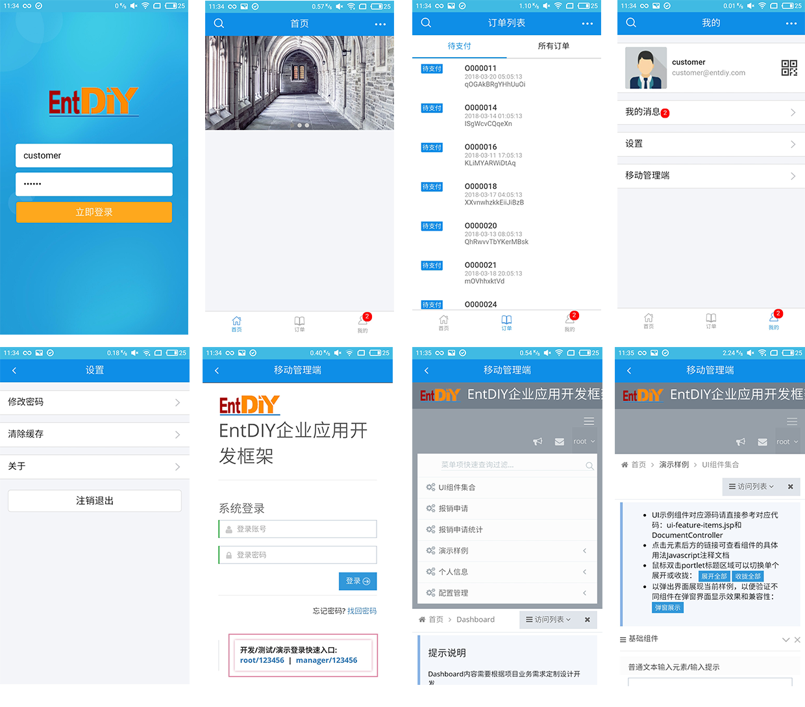

## 概要说明

基于Webpack/NodeJS/React/Cordova的Hybrid混合式APP与Restful API接口的集成应用



## 目录结构说明
```
├── config                        // webpack相关的配置文件
├── cordova                       // 编译成cordova项目之后的代码
├── node_modules                  // 项目的所有依赖项目、插件等
├── public                        // index.html的模版文件
├── scripts                       // npm scripts
├── src                           // 项目主要源代码
    ├── actions                   // redux的actions和types
    ├── components                // 拆分的小组件
    ├── containers                // 主体页面
    ├── images                    // 图标文件
    ├── reducers                  // redux的reducers
    ├── styles                    // css目录
    ├── utils                     // 实用组件封装 api、加密等
    ├── index.js                  // 项目入口文件
    ├── routes.js                 // 项目所有路由
    ├── store.js                  // redux的store
    ├── storeFilter.js            // store中间件 实现了白名单过滤功能
├── others...


npm start                         //本地浏览器环境调试  
npm run ios                       //ios模拟器中预览  
npm run android                   //android模拟器中预览  
npm run build:ios                 //编译为ios代码  
npm run build:android             //编译为android代码  

补充：
对不同的平台进行编译和预览需要对应平台环境的支持 例如ios的xcode、android的sdk等
一般来说只需要关注src目录下的代码
普通调试使用npm start即可 需要调用设备硬件的功能推荐使用模拟器中预览
定位具体页面的代码推荐从routes.js入手 根据页面的url来判断
API_HOST根据项目需求 单独放在config/api_host.js下面
```

## 技术架构（页面依赖）

概要说明：整个技术框架在保证各组件兼容性和版本成熟度的前提下，尽可能采用相应最新版本（相对于开发时）。以下是主要技术组件列表，供参考。 
各组件版本有可能会根据重构优化进行变更，此文档中列举的版本号仅供参考，具体请参考工程 package.json 中的定义。

项目基础脚手架地址：[https://github.com/facebook/create-react-app](https://github.com/facebook/create-react-app)

<table cellpadding="0" cellspacing="0" style="border-collapse: collapse;">
  <tr>
    <th border="0">重要程度</th>
    <th>技术组件</th>
	<th>版本号</th>
	<th>组件描述</th>
	<th>参考资料</th>
  </tr>
  <tr>
    <td>XXX</td>
    <td>animate.css</td>
	<td>3.5.2</td>
	<td>基础运动css组件</td>
	<td>
		<a href="https://github.com/daneden/animate.css">
			https://github.com/daneden/animate.css
		</a>
	</td>
  </tr>
  <tr>
    <td>XXXXX</td>
    <td>antd-mobile</td>
	<td>1.0.8</td>
	<td>基础ui组件库</td>
	<td>
		<a href="https://mobile.ant.design/docs/react/introduce">
			https://mobile.ant.design/docs/react/introduce
		</a>
	</td>
  </tr>
  <tr>
    <td>XX</td>
    <td>arale-qrcode</td>
	<td>3.0.5</td>
	<td>二维码组件，用于绘制二维码<br />（应用于个人中心上传头像）</td>
	<td>
		<a href="https://github.com/aralejs/qrcode">
			https://github.com/aralejs/qrcode
		</a>
	</td>
  </tr>
  <tr>
    <td>XX</td>
    <td>classnames</td>
	<td>2.2.5</td>
	<td>class类名处理包，用于动态组合class名</td>
	<td>
		<a href="https://github.com/JedWatson/classnames">
			https://github.com/JedWatson/classnames
		</a>
	</td>
  </tr>
  <tr>
    <td>XX</td>
    <td>cropperjs</td>
	<td>1.0.0-rc.1</td>
	<td>图片裁剪<BR />（应用于个人中心上传头像裁剪图片）</td>
	<td>
		<a href="https://www.npmjs.com/package/cropperjs">
			https://www.npmjs.com/package/cropperjs
		</a>
	</td>
  </tr>
  <tr>
    <td>XXXX</td>
    <td>crypto-js</td>
	<td>3.1.9-1</td>
	<td>接口加密<br />（应用于所有接口加密，默认关闭）</td>
	<td>
		<a href="https://www.npmjs.com/package/crypto-js">
			https://www.npmjs.com/package/crypto-js
		</a>
	</td>
  </tr>
  <tr>
    <td>XXXX</td>
    <td>fastclick</td>
	<td>1.0.6</td>
	<td>用于消除移动浏览器上物理点击和触发点击事件之间的300毫秒延迟。</td>
	<td>
		<a href="https://www.npmjs.com/package/fastclick">
			https://www.npmjs.com/package/fastclick
		</a>
	</td>
  </tr>
  <tr>
    <td>XXX</td>
    <td>mime</td>
	<td>1.3.6</td>
	<td>设置某种扩展名的文件的响应程序类型</td>
	<td>
		<a href="https://www.npmjs.com/package/mime">
			https://www.npmjs.com/package/mime
		</a>
	</td>
  </tr>
  <tr>
    <td>XXXX</td>
    <td>moment</td>
	<td>2.18.1</td>
	<td>日期/时间处理库，用于解析，验证，操作和格式化日期</td>
	<td>
		<a href="https://www.npmjs.com/package/moment">
			https://www.npmjs.com/package/moment
		</a>
	</td>
  </tr>
  <tr>
    <td>XXX</td>
    <td>prop-types</td>
	<td>15.5.8</td>
	<td>处于设置react组件props的规则</td>
	<td>
		<a href="https://www.npmjs.com/package/prop-types">
			https://www.npmjs.com/package/prop-types
		</a>
	</td>
  </tr>
  <tr>
    <td>XXXXX</td>
    <td>react</td>
	<td>15.5.4</td>
	<td>基础库</td>
	<td>
		<a href="https://reactjs.org/">
			https://reactjs.org/
		</a>
	</td>
  </tr>
  <tr>
    <td>XXXXX</td>
    <td>react-dom</td>
	<td>15.5.4</td>
	<td>基础库</td>
	<td>
		<a href="https://reactjs.org/">
			https://reactjs.org/
		</a>
	</td>
  </tr>
  <tr>
    <td>XXXXX</td>
    <td>react-router-dom</td>
	<td>4.1.1</td>
	<td>react路由</td>
	<td>
		<a href="https://www.npmjs.com/package/react-router-dom">
			https://www.npmjs.com/package/react-router-dom
		</a>
	</td>
  </tr>
  <tr>
    <td>XXXXX</td>
    <td>react-redux</td>
	<td>3.6.0</td>
	<td>react数据处理库（redux基础库）</td>
	<td>
		<a href="http://cn.redux.js.org/">
			http://cn.redux.js.org/
		</a>
	</td>
  </tr>
  <tr>
    <td>XXXXX</td>
    <td>redux-promise-middleware</td>
	<td>4.2.0</td>
	<td>redux处理promise异步的中间键</td>
	<td>
		<a href="https://www.npmjs.com/package/redux-promise-middleware">
			https://www.npmjs.com/package/redux-promise-middleware
		</a>
	</td>
  </tr>
  <tr>
    <td>XXXXX</td>
    <td>redux-thunk</td>
	<td>2.2.0</td>
	<td></td>
	<td>
		<a href="https://www.npmjs.com/package/redux-thunk">
			https://www.npmjs.com/package/redux-thunk
		</a>
	</td>
  </tr>
  <tr>
    <td>XXXXX</td>
    <td>redux-persist</td>
	<td>4.6.0</td>
	<td>redux的store持久化</td>
	<td>
		<a href="https://www.npmjs.com/package/redux-persist">
			https://www.npmjs.com/package/redux-persist
		</a>
	</td>
  </tr>
  <tr>
    <td>XXX</td>
    <td>react-transition-group</td>
	<td>1.1.1</td>
	<td>用于设置组件渲染/卸载的动画效果</td>
	<td>
		<a href="https://www.npmjs.com/package/react-transition-group">
			https://www.npmjs.com/package/react-transition-group
		</a>
	</td>
  </tr>
  <tr>
    <td>XXX</td>
    <td>react-redux-loading-bar</td>
	<td>2.8.1</td>
	<td>加载条组件</td>
	<td>
		<a href="https://www.npmjs.com/package/react-redux-loading-bar">
			https://www.npmjs.com/package/react-redux-loading-bar
		</a>
	</td>
  </tr>
</table>

## 技术架构（cordova）

cordova基础使用教程请参考官网：[http://cordova.apache.org/#getstarted](http://cordova.apache.org/#getstarted)

概要说明：具体请参考工程 config.xml 中的定义。

<table cellpadding="0" cellspacing="0" style="border-collapse: collapse;">
  <tr>
    <th border="0">重要程度</th>
    <th>技术组件</th>
	<th>版本号</th>
	<th>组件描述</th>
	<th>参考资料</th>
  </tr>
  <tr>
    <td>XXXXX</td>
    <td>cordova-plugin-app-version</td>
	<td>0.1.9</td>
	<td>cordova的app版本管理插件</td>
	<td>
		<a href="https://www.npmjs.com/package/cordova-plugin-app-version">
			https://www.npmjs.com/package/cordova-plugin-app-version
		</a>
	</td>
  </tr>
  <tr>
    <td>XXXXX</td>
    <td>cordova-plugin-camera</td>
	<td>2.4.1</td>
	<td>cordova的app相机插件（个人中心拍照上传头像）</td>
	<td>
		<a href="https://www.npmjs.com/package/cordova-plugin-camera">
			https://www.npmjs.com/package/cordova-plugin-camera
		</a>
	</td>
  </tr>
  <tr>
    <td>XXXXX</td>
    <td>cordova-plugin-file</td>
	<td>4.3.3</td>
	<td>读取/写入设备上的文件（用于个人中心拍照、“我的经验”读取文件、个人中心清除缓存等）</td>
	<td>
		<a href="https://www.npmjs.com/package/cordova-plugin-file">
			https://www.npmjs.com/package/cordova-plugin-file
		</a>
	</td>
  </tr>
  <tr>
    <td>XXXXX</td>
    <td>cordova-plugin-file-opener2</td>
	<td>2.0.19</td>
	<td>打开设备上的文件（用于“我的经验”打开文件）</td>
	<td>
		<a href="https://www.npmjs.com/package/cordova-plugin-file-opener2">
			https://www.npmjs.com/package/cordova-plugin-file-opener2
		</a>
	</td>
  </tr>
  <tr>
    <td>XXXXX</td>
    <td>cordova-plugin-file-transfer</td>
	<td>1.6.3</td>
	<td>上传和下载文件（用于“我的经验”文件不存在时下载文件）</td>
	<td>
		<a href="https://www.npmjs.com/package/cordova-plugin-file-transfer">
			https://www.npmjs.com/package/cordova-plugin-file-transfer
		</a>
	</td>
  </tr>
  <tr>
    <td>XXXXX</td>
    <td>cordova-plugin-inappbrowser</td>
	<td>1.7.1</td>
	<td>用默认浏览器打开app“非白名单内”的链接（否则某些课件新窗口打开了第三方链接IOS会回不去APP内部）（注：由于最终IP地址未确定，次插件并未实装生效）</td>
	<td>
		<a href="https://www.npmjs.com/package/cordova-plugin-inappbrowser">
			https://www.npmjs.com/package/cordova-plugin-inappbrowser
		</a>
	</td>
  </tr>
  <tr>
    <td>XXXXX</td>
    <td>cordova-plugin-splashscreen</td>
	<td>4.0.3</td>
	<td>设置app启动画面，具体位置请参考config.xml</td>
	<td>
		<a href="https://www.npmjs.com/package/cordova-plugin-splashscreen">
			https://www.npmjs.com/package/cordova-plugin-splashscreen
		</a>
	</td>
  </tr>
  <tr>
    <td>XXXXX</td>
    <td>cordova-plugin-statusbar</td>
	<td>2.2.3</td>
	<td>设置app的部分状态栏，如背景色等</td>
	<td>
		<a href="https://www.npmjs.com/package/cordova-plugin-statusbar">
			https://www.npmjs.com/package/cordova-plugin-statusbar
		</a>
	</td>
  </tr>
  <tr>
    <td>XXXXX</td>
    <td>cordova-plugin-whitelist</td>
	<td>1.3.2</td>
	<td>设置app的可访问链接白名单地址（目前默认为所有链接）（此处可结合inappbroswer，非白名单内的地址默认可由系统浏览器接管）</td>
	<td>
		<a href="https://www.npmjs.com/package/cordova-plugin-whitelist">
			https://www.npmjs.com/package/cordova-plugin-whitelist
		</a>
	</td>
  </tr>
  <tr>
    <td>XXXXX</td>
    <td>phonegap-plugin-barcodescanner</td>
	<td>6.0.8</td>
	<td>扫描二维码/条形码的插件（用于首页右上的“扫一扫”功能）（目前扫描有“关注用户”、“课程签到”、“进入课程详情”三个功能）</td>
	<td>
		<a href="https://www.npmjs.com/package/phonegap-plugin-barcodescanner">
			https://www.npmjs.com/package/phonegap-plugin-barcodescanner
		</a>
	</td>
  </tr>
</table>