## 总体说明

对于企业应用具有一个功能强大的表格Grid组件，无论对于开发和用户体验来说，都能起到事半功倍的效果。经过多个项目经验积累，框架选择了目前主流的[JQuery jqGrid插件](http://www.trirand.com/blog/)。
该Grid组件功能非常丰富强大，除了一些分页、多字段排序等基础功能外，还包括诸如TreeGrid、SubGrid、AdvancedSearch、Group、ColumnChooser等众多高级特性，具体可参考其官方示例[jqGrid Demo](http://trirand.com/blog/jqgrid/jqgrid.html)。

框架层面一方面从前端对组件进行了封装增强，使开发过程只需简单基础配置定义即可拥有强大的表格组件功能；另一方面与Java后端进行充分整合，封装简化实现基本无需或很少量编码即可实现大量复杂常见的非功能需求功能：

* 简单灵活的分页、（多字段支持）排序
* 快速查询、高级组合嵌套查询
* 方便实用的主子表格处理
* 简化统一的Excel基础导出功能支持
* DND拖拽支持
* 功能强大的Inline Edit支持

## 典型功能介绍

以下对框架集成Grid组件的一些典型功能进行截图示意介绍，由于框架还在不断完善过程中，以下截图可能和最新版本有所差异，但基本不影响功能使用介绍。

### 主要操作按钮

在不同的功能页面，工具条操作按钮有所差异，包含一系列图标按钮、下拉列表、右键菜单等组合，具体含义可鼠标移动上方查看提示信息了解功能含义。

以下大致按照从左至右的顺序，介绍一下主要操作按钮：

* **下拉按钮组**： 提供一些基础功能和业务功能列表，与右键菜单基本是同步的；下拉按钮组列表一般会有个基本的分隔划分原则：无需选取的按钮一组，单选行项的业务功能一组，多选行项的业务功能一组。

* **查询按钮**：点击弹出高级组合查询窗口，在此窗口可实现复杂的嵌套组合条件查询；


* **刷新按钮**：点击强制表格重新加载数据；

* **常用功能按钮**：紧随下拉按钮组之后是一些常用功能按钮，可以定制化把一些常用的业务功能按钮从下拉按钮组挑选出来放置于此方便用户快速直接点击；

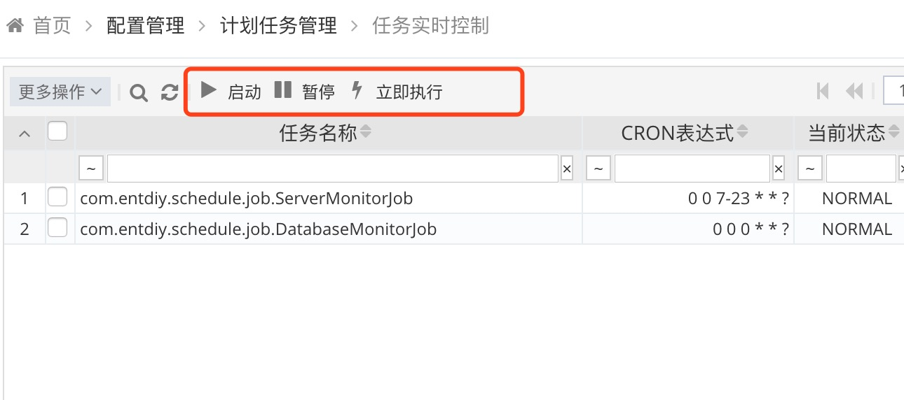

* **Inline编辑按钮**： 可以实现快速高效的直接在表格组件中快速编辑行项数据保存；除了通过点击按钮操作，同时支持在可编辑列鼠标双击进入编辑模式；

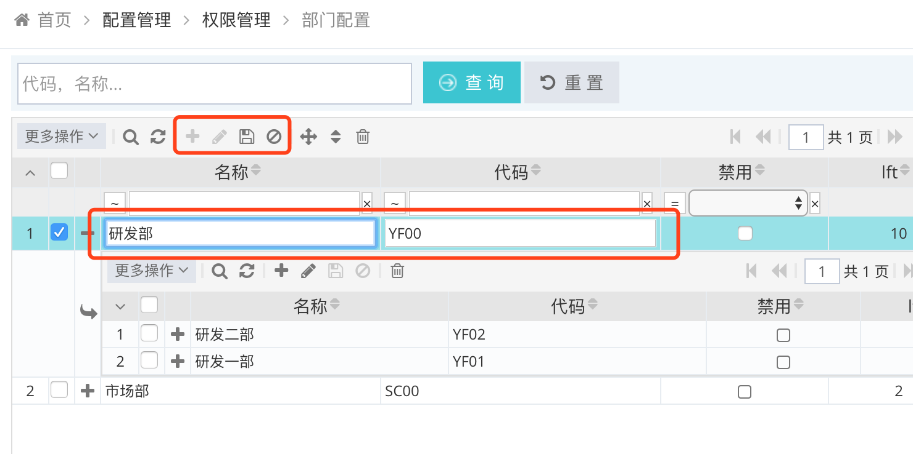

* Inline Edit 添加 按钮：进入新增行项模式;

* Inline Edit 编辑 按钮：选中一行项点击进入修改编辑模式或者在选中状态回车亦可进入编辑模式，编辑完成后点击按钮或回车保存后自动进入下一行编辑模式，便于快速连续编辑数据；

* Inline Edit 保存 按钮：编辑模式下，点击提交当前编辑数据，或键盘Enter回车同样效果；

* Inline Edit 取消 按钮：编辑模式下，点击取消当前编辑数据，或键盘ESC退出键同样效果；

* **开启拖放移动操作模式**： 在一些如菜单的典型父子关系的表格页面，点击对应操作按钮后可以鼠标自由拖拽形式调整各节点父子关系和同级节点相对排序，操作便捷高效。具体详见随后专门章节说明。

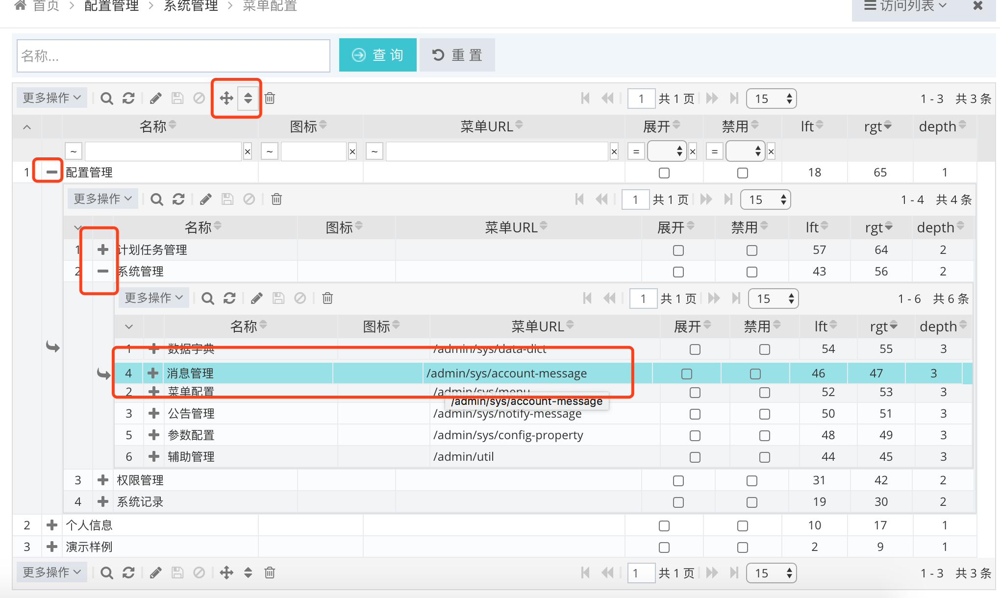

* **表单编辑按钮**：Inline编辑模式主要适用于一些字段较少编辑简单的操作对象，绝大部分对象编辑还是需要定制的复杂编辑界面，通过点击对应按钮弹出相应的新增或编辑对象界面；
其后是一个典型的"删除"操作按钮，批量勾选列表行项，点击此按钮提交批量删除操作。

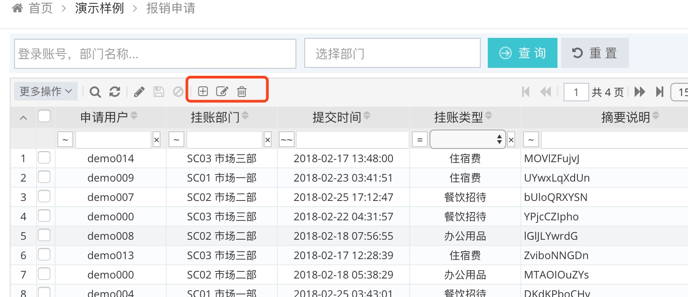

其余一些操作按钮在"更多操作"下拉菜单列表：


* **收缩显示模式**：一般情况下表格会自动计算各列合适宽度以刚好显示在表格数据区域，
但在表格列较多或显示宽度较窄的情况下，无法比较整齐的显示所有列数据，会自动以扩展模式显示出现横向滚动条，需要用户通过拉动横向滚动条查看数据；
但是如果用户还是希望以紧凑形式显示所有列数据，可以点击此按钮，表格将自动收缩显示数据。
目前限制:收缩后无法返回，需要整体刷新表格才能重新按照扩展模式显示。


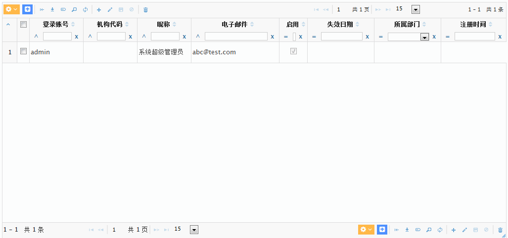

* **导出当前显示数据**：基于当前动态显示的列和行项数据导出Excel下载文件（注意：通用功能只实现当前页码表格数据导出，如果需要导出所有查询数据需要单独编码实现）；

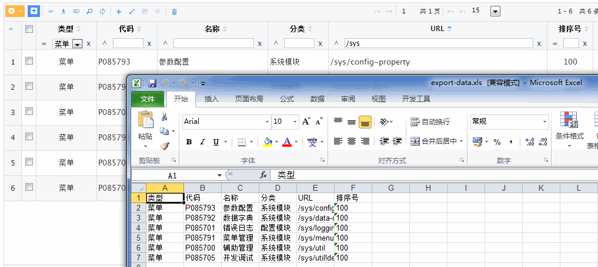

* **设定显示列和顺序**：可以实现对列顺序调整、显示/隐藏列控制等，支持两种操作方式：

* 直接表头鼠标右键点击，弹出列表勾选即可

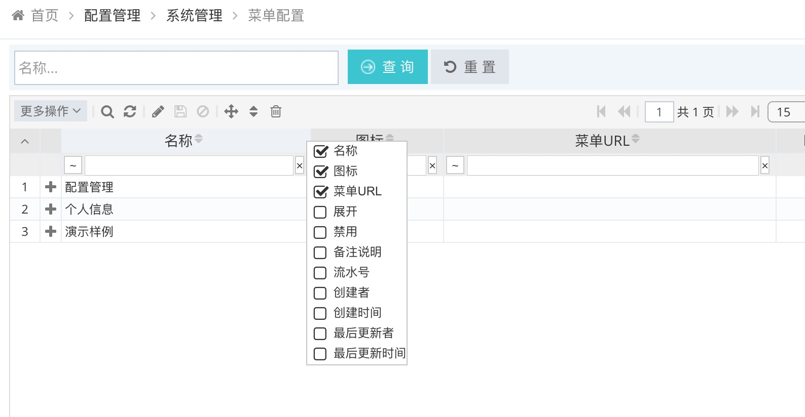

* 通过操作菜单项弹出显示列编辑界面，调整显示列和拖放调整排序

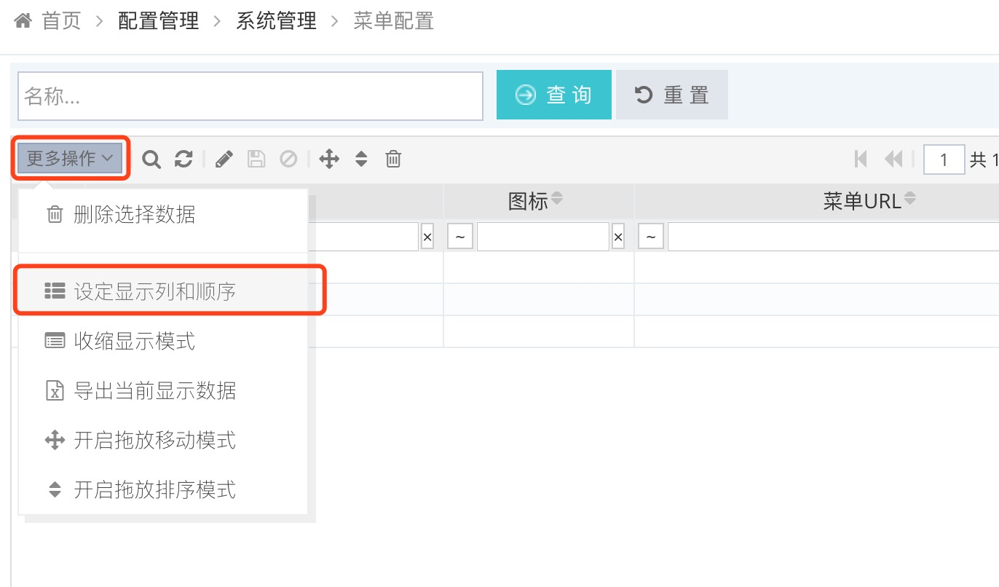

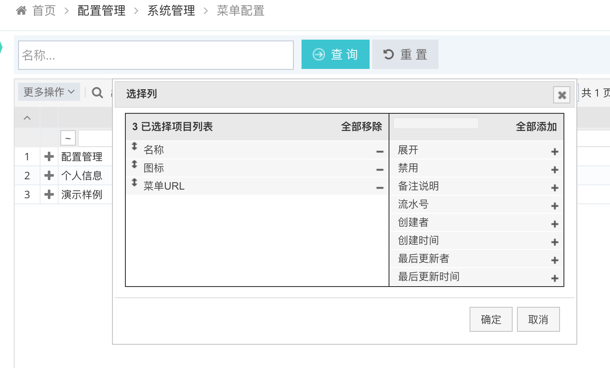

## 动态参数/分页/排序

对于一个企业系统，数据查询需求无处不在，作为一个基础框架，一方面需要向用户提供功能强大，交互友好的查询支持可以极大提升用户体验，另一方面又需要考虑开发层面尽量抽取封装以简化开发人员重复的，繁琐的数据组装等代码编写也非常关键，同时还能保证设计实现的规范一致性。

框架基本打通前端UI到后端数据访问的动态参数/分页/排序整个环节，基本只需要少量的按照参数名称规则，对于Grid表格数据查询基本不用任何编码，即可实现非常灵活而强大的动态数据访问支持。基本流程是把Web前端传入的按照约定的参数集合转换为结构化查询对象，然后传入业务层组装为基于JPA Criteria语法的Spring  JPA Data识别的动态查询对象，最终由Hibernate转换为底层数据库查询SQL语句。

### 快速过滤查询

组件上方的快速过滤查询区域，可以实现对列数据方便快速的过程查询，点击左侧小三角可以切换过滤条显示控制。
支持常见的三种输入类型：

* 文本框： 可以快速输入文本、数字等查询条件
* 下拉框：可以对于一些枚举类型数据以下拉框选取方式快速过滤查询
* 日期选取组件：日期类型数据快速选取查询

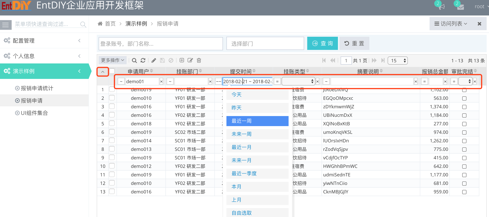

除此，点击各查询输入组件左侧的操作符链接即可快速切换查询类型，各列会根据列数据类型或用户定义动态显示可选的查询类型：


### 分页、排序

* 分页导航信息和操作区域
* 排序：支持多字段组合排序，根据点击先后和次数组合多字段排序


### 高级组合查询

点击弹出高级组合查询窗口，在此窗口可实现复杂的嵌套组合条件查询；


## 高效的递归树形结构数据展现和管理操作

一般的应用系统涉及大量父子关系的递归树形结构数据对象，框架结合Adjacent List Model 与 Nested Set Model两种模型定义树形结构对象，
可以有效的支持父子关系、层级关系、包含关系、相邻关系等不同纬度业务逻辑实现，同时前端Grid组件与后端数据处理结合，虽然还受限于一些各组件整合集成成熟度存在一些使用限制，
但是基本来说已经比较完整的支持实现了各种典型的层级数据的直接拖放操作，诸如父子关系调整，同级节点相对排序调整等，大幅提升了操作效率和用户体验。

两种模型的结合，不仅从数据管理操作层面提升了便捷，另外一个层面对数据查询和统计的功能支持和性能优化会起到一个更好的底层支持，
Adjacent List Model单纯的parent关联要实现一些诸如区间、族谱、路径等查询统计需要大量的表JOIN操作，结合Nested Set Model后就可以转换为一些高效的数字区间处理，大幅提升查询效率。

当然，两种模式既然都存在就必要各有优缺点，主要还是需要结合业务需求，分析数据更新和查询的各自频率、数据量、统计纬度等特点，选择合适的数据模型。具体两种模型概念细节，请自行网上搜索了解。


目前框架表格操作存在的一些限制说明如下：

* 父子关系调整和同级顺序调整需要分别点击两个不同按钮操作，要切换操作模式请先刷新整个表格，再点击另外操作按钮；
* 需要先提前把待操作的各子表格展开后，再点击操作按钮以实现各展开表格间数据拖放移动操作；
* 开启拖放模式后，则无法再进行常规的文本内容选取复制操作，需要重新刷新表格返回正常的编辑模式；
* 点击操作按钮只能开启拖放模式，不支持再次点击取消拖放，只能通过刷新整个表格恢复普通非拖放模式；

## 分组/聚合/统计

 除了基本的数据列表展示，对于企业应用系统还有一种很常见的分组聚合统计，例如需要把明细库存信息按照库存地/商品，销售单明细按照商品毛利/订单毛利/销售员利润等不同维度进行分组汇总统计显示。
 
 一般情况此类非常规分页查询数据访问，首先会想到采用JQL/HQL或Native SQL形式编写自由而复杂连表风组聚合统计，但是一个此种方式一个比较繁琐的问题就是不便于以简单统一的方式处理动态参数的组装，还有排序分页之类的特性支持，以及返回集合数据的组装。
 
 为了简化此类需求的开发，框架做了一个基于JPA Criteria的进一步封装，开发层面只需Web层简单传入需要分组和聚合规则（典型的加减乘除以及case when和as语法支持等）的属性列表，即可返回与之对应便于用于JSON序列化的Map结构数据，最方便的是即便是聚合属性也能像常规的对象属性查询一样支持动态参数/分页/排序等特性。
 
### 库存分组聚合统计
 
 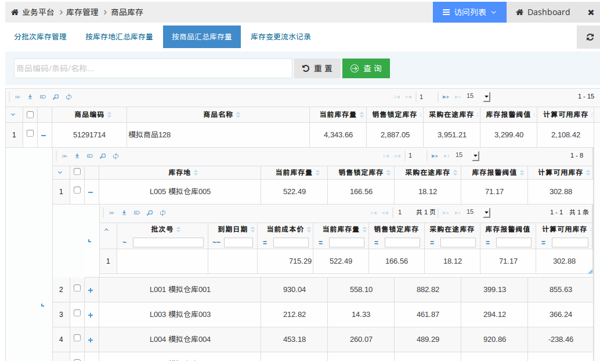
 
 * Controller代码示例：
``` java
     @MetaData(value = "按库存地汇总库存量")
    public HttpHeaders findByGroupStorageLocation() {
        setModel(findByGroupAggregate("commodity.id", "commodity.sku", "commodity.barcode", "commodity.title",
                "storageLocation.id", "sum(curStockQuantity)", "sum(salingTotalQuantity)",
                "sum(purchasingTotalQuantity)", "sum(stockThresholdQuantity)", "sum(availableQuantity) as sumAvailableQuantity"));
        return buildDefaultHttpHeaders();
    }

    @MetaData(value = "按商品汇总库存量")
    public HttpHeaders findByGroupCommodity() {
        setModel(findByGroupAggregate("commodity.id", "commodity.sku", "commodity.barcode", "commodity.title",
                "sum(curStockQuantity)", "sum(salingTotalQuantity)", "sum(purchasingTotalQuantity)",
                "sum(stockThresholdQuantity)", "sum(availableQuantity)"));
        return buildDefaultHttpHeaders();
    }
```
 
 
 * JSP/JS(部分)代码示例：
 
``` javascript
        url : WEB_ROOT + '/biz/stock/commodity-stock!findByGroupStorageLocation',
        colModel : [ {
            label : '商品主键',
            name : 'commodity.id',
            hidden : true,
            hidedlg : true,
            editable : true
        }, {
            label : '商品编码',
            name : 'commodity.sku',
            width : 80,
            align : 'center'
        }, {
            label : '商品名称',
            name : 'commodity.title',
            width : 200,
            align : 'left'
        }, {
            label : '库存地',
            name : 'storageLocation.id',
            width : 150,
            stype : 'select',
            editoptions : {
                updatable : false,
                value : Biz.getStockDatas()
            }
        }, {
            label : '当前库存量',
            name : 'sum(curStockQuantity)',
            width : 60,
            editable : true,
            formatter : 'number'
        }, {
            label : '销售锁定库存',
            name : 'sum(salingTotalQuantity)',
            width : 60,
            editable : true,
            formatter : 'number'
         }    
```

### 销售分组聚合统计
 
  

 * Controller代码示例：
``` java
    @MetaData(value = "销售商品毛利统计", comments = "由于可能出现完全赠品类型的0销售额订单，需要引入case when判断处理否则会出现除零错误")
    public HttpHeaders findByGroupCommodity() {
        setModel(findByGroupAggregate("commodity.id", "commodity.sku", "commodity.title",
                "max(case(equal(amount,0),-1,quot(diff(amount,costAmount),amount))) as maxProfitRate",
                "min(case(equal(amount,0),-1,quot(diff(amount,costAmount),amount))) as minProfitRate",
                "sum(diff(amount,costAmount)) as sumProfitAmount", "sum(amount)", "sum(quantity)",
                "case(equal(sum(amount),0),-1,quot(sum(diff(amount,costAmount)),sum(amount))) as avgProfitRate"));
        return buildDefaultHttpHeaders();
    }
```
 
 
 * JSP/JS(部分)代码示例：
 
 
``` javascript
        url : WEB_ROOT + "/biz/sale/sale-delivery-detail!findByGroupCommodity",
        colModel : [ {
            name : 'commodity.id',
            hidden : true,
            hidedlg : true
        }, {
            label : '商品编码',
            name : 'commodity.sku',
            width : 50,
            align : 'center'
        }, {
            label : '商品名称',
            name : 'commodity.title',
            width : 200,
            align : 'left'
        }, {
            label : '最低毛利率',
            name : 'minProfitRate',
            width : 40,
            formatter : 'percentage'
        }, {
            label : '最高毛利率',
            name : 'maxProfitRate',
            width : 40,
            formatter : 'percentage'
        }, {
            label : '平均毛利率',
            name : 'avgProfitRate',
            width : 50,
            formatter : 'percentage'
        }, {
            label : '总计销售数量',
            name : 'sum(quantity)',
            width : 50,
            formatter : 'number'
        }, {
            label : '总计销售金额',
            name : 'sum(amount)',
            width : 50,
            formatter : 'currency'
        }, {
            label : '总计毛利金额',
            name : 'sumProfitAmount',
            width : 50,
            formatter : 'currency'
        } ] 
```

### 主要接口实现定义
 
``` java
    /**
     * 分组聚合统计，常用于类似按账期时间段统计商品销售利润，按会计科目总帐统计等
     *
     * @param groupFilter 过滤参数对象
     * @param pageable    分页排序参数对象，TODO：目前有个限制未实现总记录数处理，直接返回一个固定大数字
     * @param properties  属性集合，判断规则：属性名称包含"("则标识为聚合属性，其余为分组属性
     *                    属性语法规则：sum = + , diff = - , prod = * , quot = / , case(condition,when,else)
     *                    示例：
     *                    sum(amount) as xyz
     *                    count(id) as xyz
     *                    sum(diff(amount,costAmount)) as xyz
     *                    min(case(equal(amount,0),-1,quot(diff(amount,costAmount),amount))) as xyz
     *                    case(equal(sum(amount),0),-1,quot(sum(diff(amount,costAmount)),sum(amount))) as xyz
     * @return Map结构的集合分页对象
     */
    @Transactional(readOnly = true)
    public Page<Map<String, Object>> findByGroupAggregate(GroupPropertyFilter groupFilter, Pageable pageable, String... properties)
```

### 其他特性

具体可访问示例应用体验这些特性效果。

* 表格宽度、高度的自适应
* 奇偶行颜色交替
* 表头宽度调整
* 表头列顺序调整
* 双击行项事件
* ......
