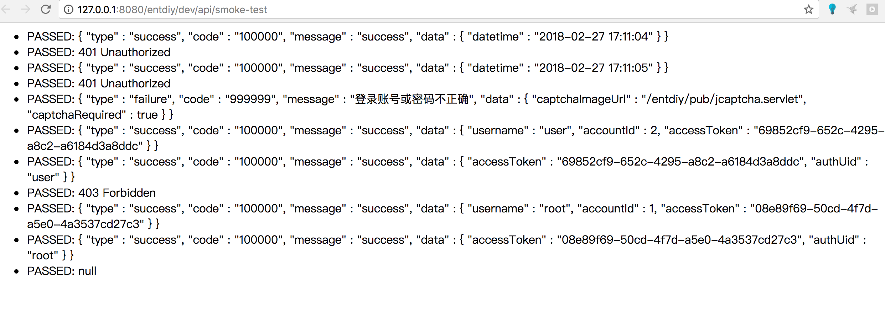
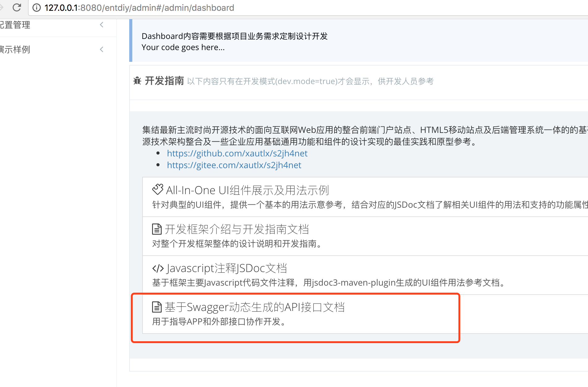
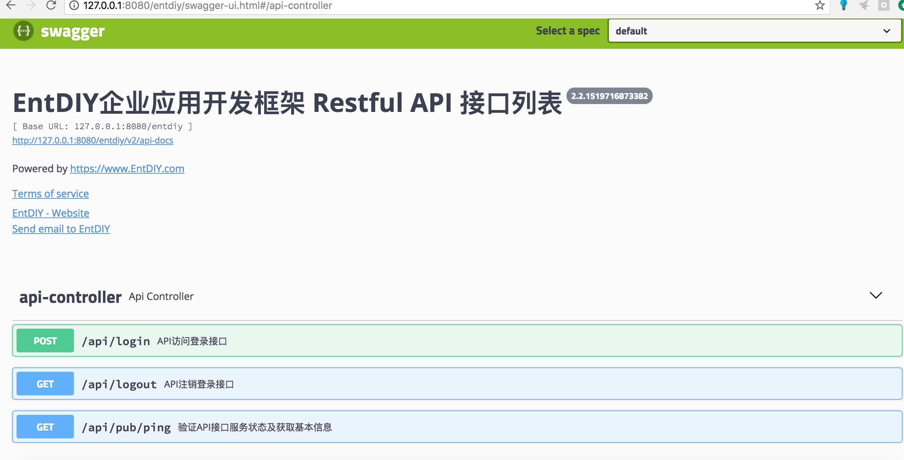

## API接口设计


### Apache Shiro配置

API权限相关基于Shiro实现，主要入口配置定义详见spring-shiro.xml配置内容，主要如下：

``` xml
                /api/pub/** = anon
                /api/login = authcAppForm
                /api/logout = logoutApp
                /api/** = authcApiClient,authcAccessToken
```

主要涉及过滤控制器如下：
 
 * ClientValidationAuthenticationFilter：
 
 对Client请求进行鉴权和校验，引用了oauth的设计理念，考虑到API接口主要面向内部系统或对应APP调用，
 采用一个简化的appkey和appsecret模型，直接在配置文件中定义，如果需要实现更灵活的接口对外支持则需要进一步扩展，可以参考微信OpenAPI之类的接口平台设计思路。
 
 框架基于主流的timestamp，nonce，sign等控制请求头实现了基本的签名鉴权处理，可以有效的防止接口被恶意调用或攻击。同时可以在此基础上进一步实现防重放、防数据篡改等功能特性。
 
 * JcaptchaFormAuthenticationFilter：
 
 处理 /api/login 请求，除了提供常规的账号username和密码password认证处理，同时会做一些防攻击处理，密码错误一定次数后则强制要求客户端输入提供验证码以防暴力破解。
 认证通过后继续调用 ApiController.apiLogin 处理响应JSON数据，包括的主要属性包括：
 
 accountId: 登录账号唯一标识id
 
 accessToken: 用于后续无状态接口访问的token值，除了在响应数据返回外，同时在response header中也以ACCESS-TOKEN同步返回，以便客户端自由获取
 
 captchaRequired：如果多次请求的密码不正确，则此属性为true表示需要用户额外输入验证码以防外部连续请求暴力破解密码
 
 captchaImageUrl：captchaRequired=true则同时提供此值，验证码图片请求URL地址，APP客户端在登录界面显示此验证码图片引导用户输入，以captcha参数名提交到/app/login请求。
 
 * BearerTokenAuthenticatingFilter：
 
 通过上述的login认证接口，获取到accessToken值后，后续所有请求把此值以 ACCESS-TOKEN 请求Header形式追加到接口请求里，此过滤器负责以无状态形式拦截判断ACCESS-TOKEN值的合法性并定位请求所属用户。

### APP调用API接口大致流程

对于一般APP调用API接口大致的过程如下：

* 调用 /api/pub/ping 接口，此接口为完全开放接口，无需提供任何client或user认证信息，用于获取当前API服务状态是否可用，同时返回当前服务器时间信息。
这个服务器时间数据客户端可根据需要合理使用：之前提到ClientValidationAuthenticationFilter中可以基于timestamp及相关签名数据，限制请求只能在一定偏差范围内如60s才算合法请求，
因此就需要保证客户端时间与服务端时间保持足够的同步性，因此客户端可以使用这个接口返回的服务器时间数据，构造一个APP当前应用本身的时间对象，然后APP程序自行递增此时间戳，
每次以程序自增的时间戳作为请求的timestamp值，就不用担心移动端系统层面时间值和服务器偏差太大导致请求校验失败。

* 每个APP分配一个appkey和appsecret值，APP程序中保存appsecret，然后按照约定的加密签名规则（ClientValidationAuthenticationFilter中定义的编码规则和加密算法），生成并组装相关数据追加到请求头信息

* 调用 /api/login 登录接口，提供username和password，以及可选的captcha，发起登录请求，获取到accessToken

* 把登录接口获取到accessToken缓存到本地，后续所有业务接口请求都把此值以ACCESS-TOKEN请求Header附上

* 如果需要切换用户或注销登录，则调用 /api/logout 注销服务端会话，成功后删除本地缓存的accessToken，然后转向APP的开放首页或登录界面

### API接口冒烟测试验证

开放框架提供一个基础的冒烟测试方法，一方面可以简单的验证相关配置和服务运行正常，一方面相关测试逻辑代码可以作为API用法编码参考。菜单入口，配置管理-》系统管理-》辅助管理，API接口冒烟测试。

能正常看到各PASSED响应数据，则说明冒烟测试通过：



具体测试代码可参考 DevelopController.apiSmokeTest 方法。

### Swagger API文档工具

框架集成Swagger API文档工具，可以有效展现API接口清单并提供一个标准的Restful测试客户端，可以方便的在线测试联调API接口，实现与APP开发团队有效的协作开发。

Swagger的主要配置在SwaggerConfig类中定义，可根据需要灵活调整。默认配置规则只扫描@RestController注解的类不包括@Controller注解类，因此注意把业务相关的API接口单独定义到@RestController注解的类中。

UI界面示例如下：






