### 项目发展模式

为了本项目的健康可持续发展，按照流行的免费开源社区版(Community Edition)和收费服务专业版(Professional Edition)运作模式。

本项目核心旨在提供一整套基于 Java 8 + SpringMVC/Spring 5 + Hibernate 5.2/MyBatis 3/JPA 2.1/Spring Data 2 + React/Cordova Hybrid APP 
等主流开源技术架构整合及企业级Web应用的设计实现的最佳实践和原型参考，对于初学者来说社区版所有开源内容已具有足够全面的参考借鉴价值。

在对社区版充分了解和试用并全面评估技术风险的基础上，对于有意采用开发框架进行产品或项目二次开发和设计交付的用户，可考虑付费获取专业版授权许可。

* 社区版技术交流渠道

QQ群讨论组：303438676 或提交到Git平台的Issue：

https://github.com/xautlx/s2jh4net/issues , https://gitee.com/xautlx/s2jh4net/issues

* 专业版咨询及技术支持

除了开发框架，如果还对诸如利用VMWare ESXi、虚拟Mac OSX、React/Cordova混合式APP、Jenkins持续集成Java Web/Android和iOS APP自动化构建分发、Docker化开发测试运维部署、Ngrok/HTTPS内网穿透服务、
JRebel(远程)热部署开发模式等DevOps理念和工具以全面提升开发测试运维等整个技术团队综合实力、研发效率和交付质量等主题感兴趣，详情可访问了解 [专业版资源摘要](entdiy-devops/entdiy-dev-guide/src/main/resources/META-INF/resources/dev/docs/markdown/800.许可说明.md#专业版资源摘要)

EMail: xautlx@hotmail.com 或 QQ: 2414521719 ，由于个人精力有限，专业版咨询方式仅限专业版咨询和付费用户，普通技术咨询请通过上述社区版渠道沟通，敬请理解。

### 版本对比说明
<table class="edition-compare" style="width: 100%;">
    <tr>
        <th></th>
        <th style="width:30%;">开源社区版</th>
        <th style="width:30%;">专业个人版</th>
        <th style="width:30%;">专业企业版</th>
    </tr>
    <tr>
        <td>
            项目源码
        </td>
        <td>
            除 entdiy-webapp/src/main/webapp/assets/apps/scripts 目录下相关UI组件JavaScript代码以混淆压缩版本形式提供，
            其余全部开源，足以覆盖对于各Java EE主流开源技术框架集成设计开发的学习参考之用
        </td>
        <td colspan="2">
            提供混淆压缩JavaScript文件全部源码，包含详细的JavaScript编码注释
        </td>
    </tr>
    <tr>
        <td>
            功能资源
        </td>
        <td>
            开发框架完整所有应用模块功能及WIKI文档
        </td>
        <td colspan="2">
            提供不断完善的基于框架开发过程、项目交付、运维部署等相关经验、文档、脚本等资源分享，
            详见 <a href="800.许可说明.md#专业版资源摘要">专业版资源摘要</a>
        </td>
    </tr>
    <tr>
        <td>
            技术支持
        </td>
        <td>
            开放渠道Issue反馈，群组讨论等
        </td>
        <td>
            1个月定向技术支持
        </td>
        <td>
            3个月定向技术支持
        </td>
    </tr>
    <tr>
        <td>
            许可范围
        </td>
        <td>
            可随意修改代码内容，但需保留项目LICENSE.md文件及代码文件中版权头注释内容，可完全自由免费使用
        </td>
        <td>
            可随意移除本框架版权信息及代码内容，但仅限用于以个人名义的设计交付的产品或项目
        </td>
        <td>
            在继承个人版授权基础上，同时可用于以企业(公司)名义的设计交付的产品或项目
        </td>
    </tr>
    <tr>
        <td>
            许可期限
        </td>
        <td>
            N/A
        </td>
        <td colspan="2">
            1年期专业版GIT资源库访问权限，到期可不限次数主动申请免费续期
        </td>
    </tr>
    <tr>
        <td>
            许可费用
        </td>
        <td>
            永久免费
        </td>
        <td>
            RMB 1,024
        </td>
        <td>
            RMB 3,072
        </td>
    </tr>
</table>

### 常见问题解答

* **本技术框架和专业版资源适用于那些领域或技术架构的项目或产品**

简单一句话：定位于面向中小规模技术团队的企业/行业应用系统项目或产品。本框架整体技术选型以及专业版涉及的技术资源，主要目标都是旨在应用最主流的技术和DevOps理念，
能快速容易找到合适的技术人员组建项目技术团队，以更少的人员更高效更快速的完成项目或产品整个项目管理、设计开发，交付运维等各个软件生命周期活动。

框架最主要的技术简单来说就是Spring/Hibernate/JPA/JQuery/Bootstrap这几项，
具体可查阅 [技术特性](110.技术特性.md) 和 [技术列表](100.技术列表.md) 了解详情以便结合自身团队技术背景和选型综合评估。

如果你的技术团队规划是往Spring Boot、Spring Cloud、Alibaba Dubbo、MyBatis等类似面向微服务、互联网等技术或领域方向发展，
那建议基本就不用整体考虑本技术框架了，当然其中一些技术点如果有兴趣可以参考借鉴。

* **我在目前公司上班，希望把这套框架引入到工作去完成公司的项目，我该选择个人版还是企业版授权？**

作为一个过来人，这个其实能理解和体会，公司或领导一个决策一个号令，恨不得今天启动项目明天就交付，作为项目或技术的负责人面临极大的技术选型压力。
或许你正好接触到这套框架，感觉饶有兴趣，但是却纠结于如何消化这笔授权费用，我的建议是：首先请确保对框架已有充分的理解和认知并进行比较全面的技术风险评估，
如果通过之后，可以向公司或领导明确说明个人版和企业版授权对比，如果公司或领导层面不打算投入足够经费支持并且不介意承担潜在的侵权责任，你可以选择个人版授权。

虽然作者无法对每个授权最终用途做到全面跟踪，但是一旦发现企业或公司违规使用个人版授权，将保留追究其侵权责任的权利。

* **授权费用如何支付？有支付凭证或发票之类吗？**

整个项目个人性质运作，无任何公司相关流程支持，暂无提供任何支付凭证或正规发票之类。

目前只接受微信或支付宝一次性转账支付方式，建立最基本的信任基础之上，不至于说付款后卷款跑路，因为知识的价值无论付款与否都在那里摆着并且无形可以无限次复用。

### 专业版资源摘要

友情提示：以下主题内容详细文档和资料属于付费专业版资源，开源免费社区版代码库中不包含，敬请注意！

此部分内容会根据框架应用经验、技术发展趋势以及作者工作经验和技术方向等不断调整和完善，以下对一些主要主题大致摘要说明，具体相关文档、配置、脚本等资源详见专业版GIT资源库。

以下资源会尽可能封装为Docker容器和脚本，以及Jenkins配置好的自动化构建任务，尽量做到开箱即用，并配以相关说明文档，尽可能做到能让用户借鉴参考投入的实际的开发团队管理和开发协作过程中去，提升开发测试交付效率和质量。

当然很多内容不是简短一篇文档能完整描述，并且作者技能和经验毕竟有限和不足，更多还是以一种抛砖引玉供参考和共同交流的态度去分享这些资源。
对于相关文档或资源信息不足的情况下，可以联系作者给予咨询支持或远程协助指导等。

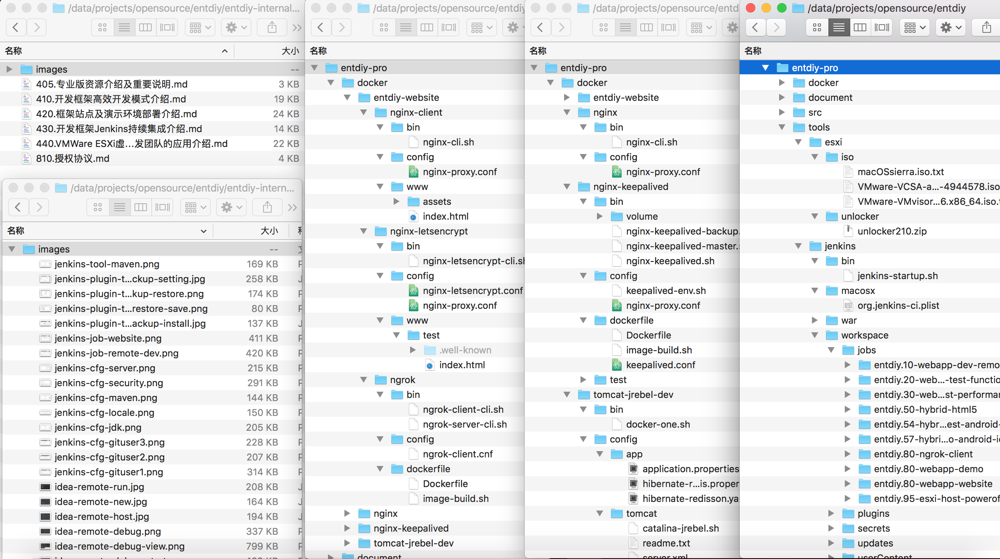

#### 基于Docker+Jenkins的Nginx+Ngrok+Letsencrypt的EntDIY框架站点及演示环境部署介绍

框架主站 https://www.entdiy.com 和 演示应用 https://demo.entdiy.com/entdiy ，均部署在本地台式机虚拟机CentOS系统并运行内网穿透工具Ngrok Client，
阿里云使用一台低配CentOS系统运行Ngrok Server作为中转服务器，并运行Nginx反向代理Ngrok服务结合Letsencrypt实现 HTTPS 访问。
整套环境全部基于Docker化封装部署，只需简单修改少量配置信息，并且提供相应的Jenkins自动化构建部署更新任务配置，基本做到开箱即用。

整套模式，对于中小团队初创期具有很高的实用价值，毕竟出于成本考虑不可能一开始就把整套应用上云部署，更常见还是自建几台高配台式机部署开发、测试、演示应用以及项目管理、版本资源库等工具应用，
借助Docker+Ngrok+Nginx+Letsencrypt只需购买一个域名和一台低配的云服务器，就可以实现一整套应用高效便捷安全的内网穿透外网访问，大幅提升项目管理和开发运维效率。
另外，还可以给相关开发人员配置各自的二级域名，如 zhangsan.entdiy.com, lisi.entdiy.com ,以https穿透指向开发人员的开发测试环境，
与此同时，还可以有效的解决诸如微信需要以域名形式开发调试、iOS APP应用发布强制要求 HTTPS 访问等特定需求。

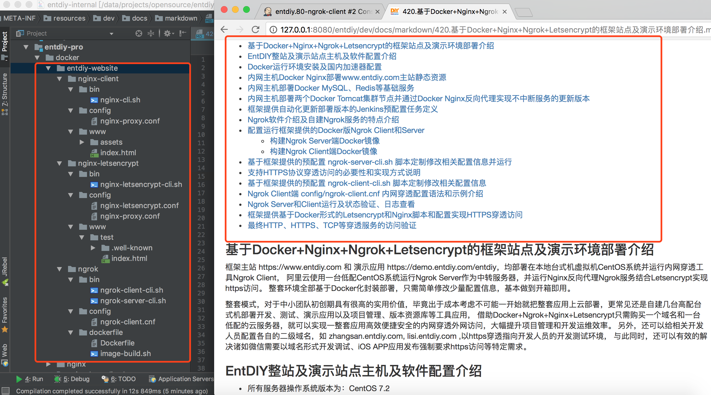

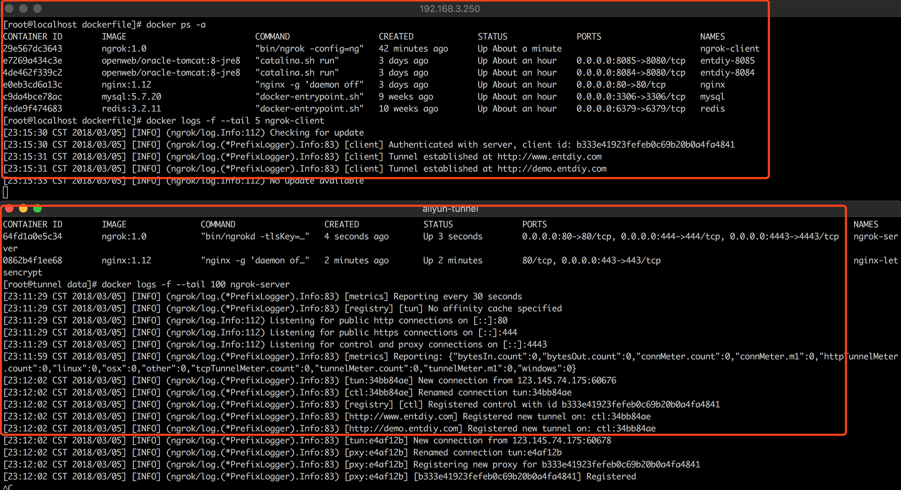

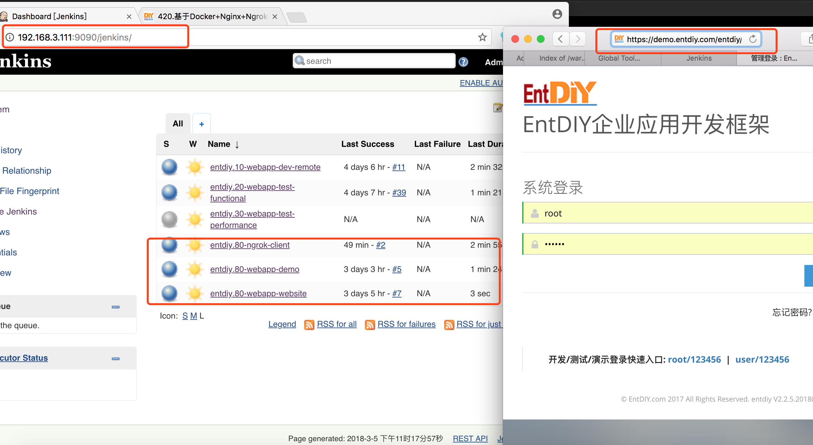

#### 基于Docker+Jenkins的IDEA+JRebel+Tomcat Local/Remote Server本地/远程实时热部署开发调试模式介绍

随着当今各工具软件尤其JavaIDE对硬件资源要求越来越高，本框架作者开发环境为MacBook Pro 8G内存版本，一旦启动各工具软件和IDEA，再启动框架应用Run或Debug模式，基本上整个系统就比较卡了。
回头一看高配台式32G内存主机，总觉得心有不甘，于是几经折腾，终于实现了一整套实时高效的远程开发模式：

本主题提供一套Docker封装的 JRebel 7 + Tomcat 8 容器在局域网虚拟机运行，然后在 IDEA 工具做相关配置，使本地 IDEA 完全解脱本地Run或Debug导致的系统资源占用，
在局域网内部的虚拟机上面完成整个应用的Run或Debug开发调试，并且近乎完美的全自动增量文件同步和热部署更新功能，实现本地修改Java编译代码或静态资源文件代码，实时刷新浏览器即可看到最新代码结果。

如果你或者你的团队成员正在抱怨每次修改代码都要等待半天重启应用，本地开发机器卡的要死不活，刚好又有富裕的服务器资源，或许可以参考参考这套模式。

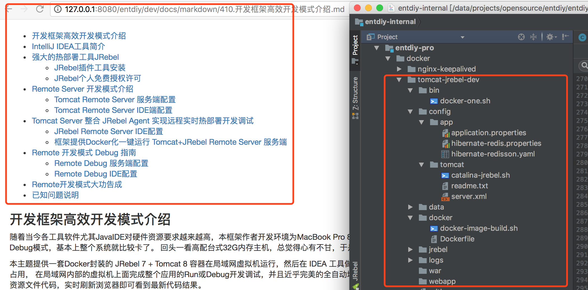

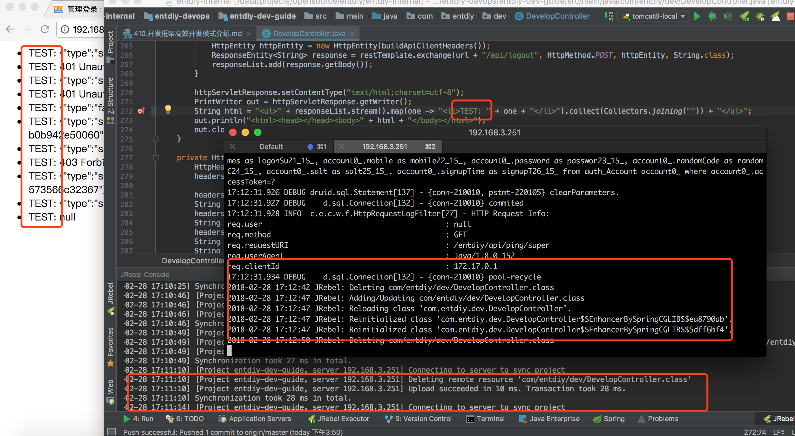

#### 开发框架基于Jenkins持续集成Java Web和Android/iOS App技术架构方面的应用和介绍

本主题将介绍围绕以Jenkins持续集成工具为主，结合主流的DevOps理念展现EntDIY框架整个开发测试演示的构建过程。
框架预制提供一套Jenkins运行配置脚本及包含一系列配置好可运行的Job定义的workspace，包括Java Web、Android和iOS的Hybrid混合式APP和Native原生APP等应用的全自动构建分发，
结合项目团队技术架构和人员分工等情况，用Jenkins持续集成手段将各个项目活动串联整合起来，打通开发测试运维等各流程环节，全面提升整个技术团队的工作效率和质量。

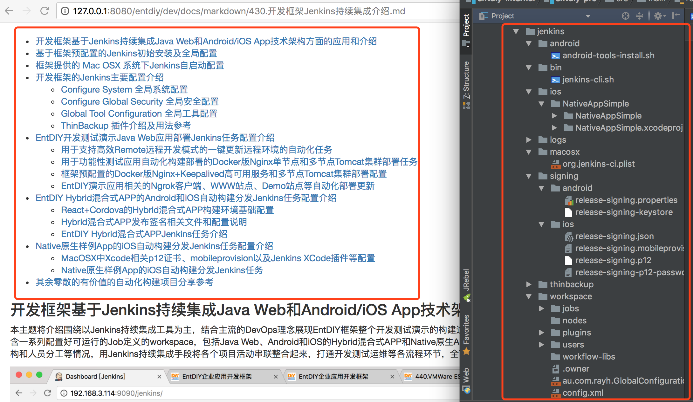
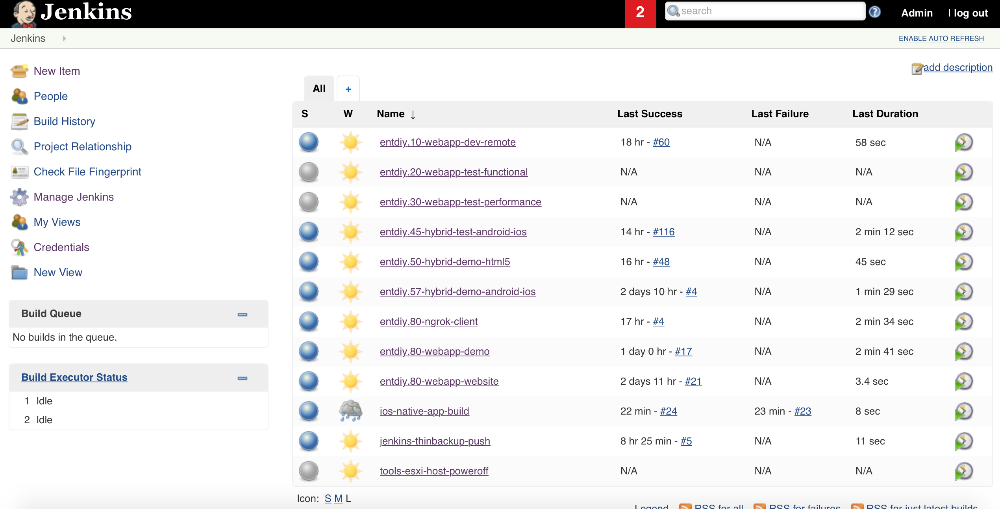

#### 基于 VMWare ESXi 6.5 虚拟化技术打造支撑研发团队开发、测试、运维、项目管理等强大灵活的IT基础架构

对于一个技术团队，随着项目规模的不断增长IT系统需求膨胀，如果还是传统方式一台台购买主机，然后一次次反复安装系统、安装软件、环境配置、部署应用等方式，
运维团队在忙碌中重复劳动，开发测试团队在等待中抱怨，当然一种最简单的方式就是使用诸如阿里云等这样的公有云，但是对于一般中小型公司或团队，整套环境都上云恐怕又扛不住高额的成本。
本教程介绍基于 VMWare ESXi 6.5 虚拟化技术应用，由于 ESXi 本身为商业技术体系，网上资料纷繁复杂并且很多还不靠谱，笔者基于多年 ESXi 的使用经验和踩过的坑，
整体介绍 ESXi Host、vCenter Server Appliance、ESXi Mac OSX（支持Jenkins XCode/iOS APP 持续集成）等一系列安装配置过程以及一些使用技巧和经验分享，
实现按需自由伸缩服务器虚拟机实例，基本可完美的支撑中小研发团队的软硬件IT资源需求。

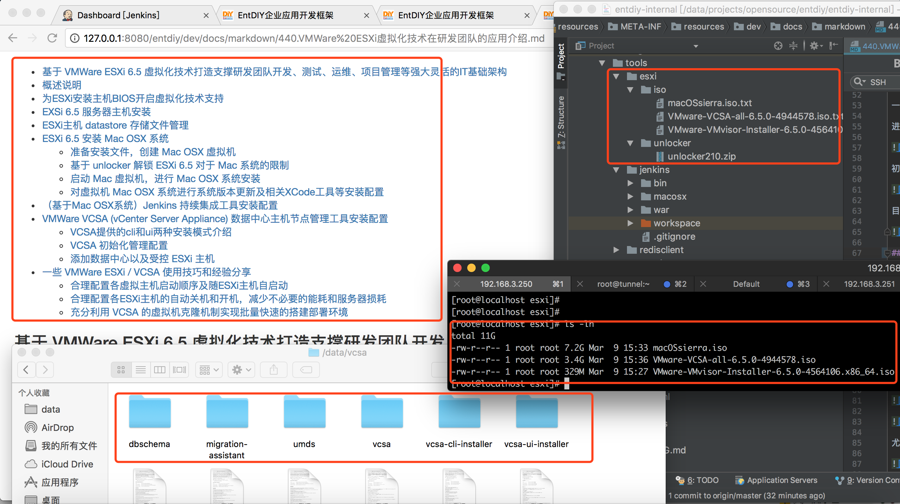
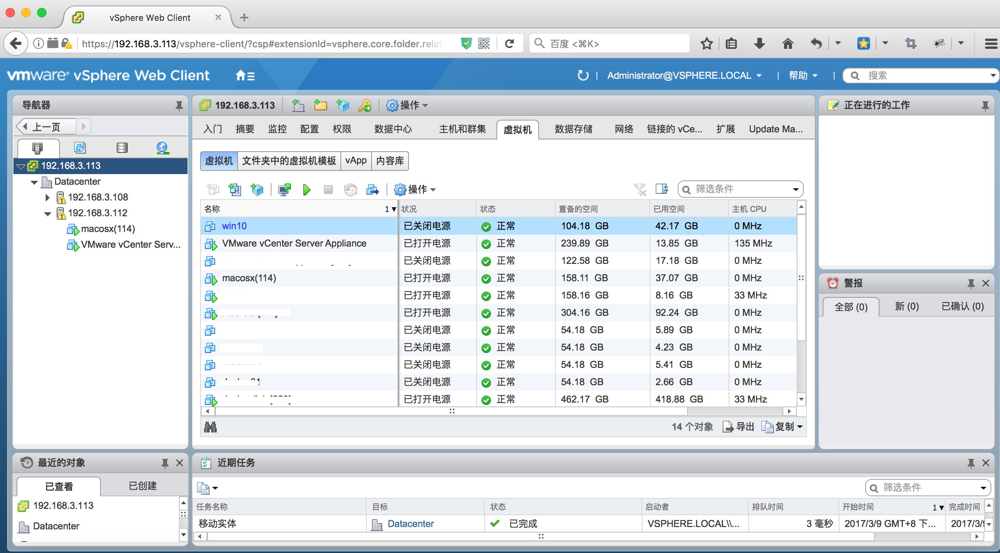
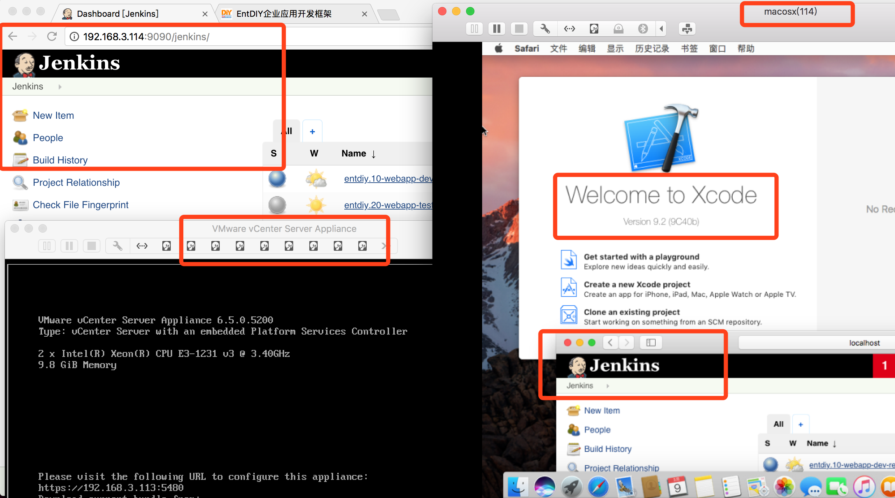

#### 其他

其他功能特性不断完善追加，同时也欢迎反馈一些感兴趣的主题，如果适合会不断整合到资源库。