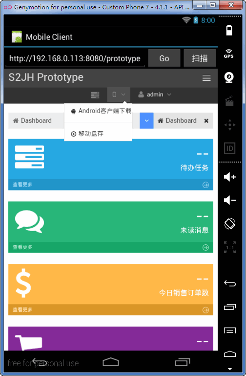

## 概要说明

在移动设备横行的年代，客户一般都希望能提供移动端访问能力，借助Bootstrap3的Mobile First理念，按照响应式布局设计，
对于同样一套Web应用，基本可以实现PC端和Mobile移动端的友好显示访问支持。

同时对于企业应用，一般还需要与移动设备进行更深层次的整合，一个典型的应用就是条码扫描功能。
比如移动盘存功能，用户只需用手机或平板安装Native App客户端应用，访问Web App，即可实现Web应用调用摄像头扫描输入单据或商品条码。

S2JH框架提供一个基础的Android Client原型工程，
详见：android_client，注意：此工程为标准Android工程结构，需要安装Android相关SDK环境和Eclipse插件才能编译运行。

# 基本用法

只需要对需要支持条码采集的输入框元素，调用input.barcodeScanSupport()，细节实现可参考代码：commodity-stock-inventory相关样例代码实现。

# 基础原型功能示例截图

