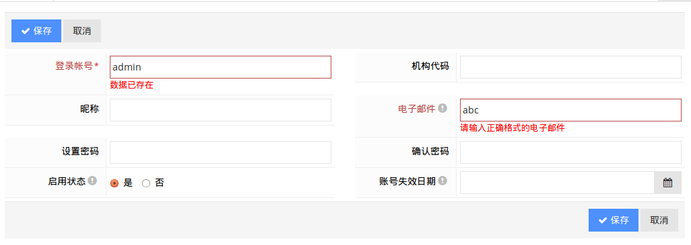

<name id="get"/>

### 列表界面的GET查询表单

其实jqGrid已经包含非常强大的查询功能，引入查询表单一方面是为了符合主流操作界面上方查询区域，下方列表区域的风格，另一方面也是考虑给用户提供一个最简单快捷的查询入口。

在框架绝大部分功能主界面，都有个大致如下结构的查询表单区域:

```HTML
	<div class="row search-form-default">
		<div class="col-md-12">
			<form method="get" class="form-inline form-validation form-search-init control-label-sm"
				data-grid-search="#grid-auth-role-index">
				<div class="form-group">
					<div class="controls controls-clearfix">
						<input type="text" name="search['CN_code_OR_name']" 
                               class="form-control input-large" placeholder="代码，名称...">
					</div>
				</div>
				<div class="form-group">
					<label class="control-label">发布日期</label>
					<div class="controls">
						<input type="text" name="search['CN_publishTime']" 
                               class="form-control input-small" data-picker="date">
					</div>
				</div>
				<div class="form-group search-group-btn">
					<button class="btn green" type="submmit">
						<i class="m-icon-swapright m-icon-white"></i>&nbsp; 查&nbsp;询
					</button>
					<button class="btn default" type="reset">
						<i class="fa fa-undo"></i>&nbsp; 重&nbsp;置
					</button>
				</div>
			</form>
		</div>
	</div>
```

主要控制属性说明如下：

**.row.search-form-default:** 为查询区域包裹一个统一的样式定义

**form.form-inline:** 主要用于控制查询区域元素横向顺序排列
**form.form-validation:** 全局的查询表单处理标识，实现基于AJAX的数据处理和JQuery Validation校验支持，必须的控制样式，否则就按照普通的get表单请求了
**form.form-search-init:** 如果添加此样式则基于表单初始化数据自动触发查询表单请求；如果对于一些界面如报表统计，需要用户输入一定查询条件后再触发则可以去掉此控制样式
**form.control-label-sm:** 一般绝大部分元素可以直接借用placeholder属性方式显示提示信息，如果业务要求以明确的label方式显示元素名称信息，此样式可以控制label区域的宽度，预置了几种可选样式：control-label-sm=Small，control-label-lg=Large，control-label-xl=Extreme Large

**form[data-grid-search]:** 指定submit查询触发对应的jqGrid查询加载，把当前表单的参数追加到jqGrid的查询参数
**form[data-div-search]:** 指定submit查询触发对应DIV加载查询结果页面内容

**.controls.controls-clearfix:** controls样式左侧会留空给label显示，添加controls-clearfix把左侧留空区域清除，用于直接placeholder风格显示查询输入元素

<name id="post"/>

### 编辑界面的POST提交表单

编辑表单涉及到数据绑定处理，所以采用Spring MVC form标签。本来考虑过采用tab形式同时展现多个编辑对象，但是存在与form:form标签内部元素id重复问题以及其他潜在的dom元素冲突问题，因此采用相对保守和主流的弹窗编辑模式，同一个时刻点基本就只能显示和编辑一个表单界面。

以角色管理编辑界面为例：

```HTML
	<form:form class="form-horizontal form-bordered form-label-stripped form-validation"
		action="${ctx}/admin/auth/role/edit" method="post" modelAttribute="entity"
		data-editrulesurl="${ctx}/admin/util/validate?clazz=${clazz}">
		<form:hidden path="id" />
		<form:hidden path="version" />
		<div class="form-actions">
			<button class="btn blue" type="submit" data-grid-reload="#grid-auth-role-index">
				<i class="fa fa-check"></i> 保存
			</button>
			<button class="btn default" type="button" data-dismiss="modal">取消</button>
		</div>
		<div class="form-body">
			<div class="row">
				<div class="col-md-6">
					<div class="form-group">
						<label class="control-label">代码</label>
						<div class="controls">
							<form:input path="code" />
						</div>
					</div>
				</div>
				<div class="col-md-6">
					<div class="form-group">
						<label class="control-label">名称</label>
						<div class="controls">
							<form:input path="name" />
						</div>
					</div>
				</div>
			</div>
		</div>
	</form:form>
```

主要控制属性说明如下：

**form.form-horizontal:** label元素和表单元素横向水平排列模式，除此还有一种纵向排列模式一般用于移动浏览器显示风格
**form.form-bordered:** 指定一个边线分隔样式
**form.form-label-stripped:** 为label区域指定一个stripped效果
**form.form-validation:** 指定开启自动表单校验支持，配合data-editrulesurl参数
**form:form[modelAttribute="entity"]:** 基于Spring MVC的自动属性绑定
**form:form[data-editrulesurl]:** 指定自动基于JSR303注解服务端构造表单校验规则的URL地址，一般默认为“${ctx}/admin/util/validate?clazz=${clazz}”即可

**<form:hidden path="version" />：** 基于Hibernate的version乐观锁控制属性，对于需要进行乐观锁控制防止多用户同时修改对象可给定此隐藏属性；如果对于一些相对宽松无需关注并发修改的对象，可以忽略此属性

“保存”提交按钮button[type="submit"]控制属性列表：

**button[data-form-action]** 如果指定此属性，则在提交表单时用对应的url取覆盖form的action属性发起请求
**button[data-confirm]** 如果指定此属性，则按照对应的提示信息给予confirm用户确认是否提交表单
**button[data-grid-reload]** 如果指定此属性，则在表单提交成功后自动刷新对应的jqGrid表格组件
**button[data-auto-reload]** 不指定默认为true，如果指定为false表示不进行自动刷新控制处理，自动刷新基本的过程是：
如果当前对话框没有或只有一个tab标签项，则自动把弹窗关闭；多个tab标签项，如果表单id有值则编辑模式刷新当前tab标签项，如果id没值则创建数据，则自动刷新整个弹窗

<name id="jsr303"/>

### 集成服务端和客户端的Form/Data Validation的设计处理

基于Javascript的前端表单校验和基于Java逻辑的服务端校验应该说都是非常重要的，前端校验可以有效的提升用户UI交互友好度，并且减少不必要数据校验目的的服务器交互；服务端校验则是评价一个系统安全性、健壮性的重要环节，因为对于Web应用来说其访问的便捷性也决定了其及其容易受到恶意用户的攻击，只需要熟悉基本的HTTP请求原理和工具，即可轻易绕过前端的数据校验直接对服务器发起非法数据请求。

对于前端来说有比较多成熟的Javascript/JQuery表单校验插件，如本框架选择的JQuery Validation。对于服务端校验，Struts层面有Struts Validator，但是总感觉非常繁琐；而现在开始流行的[JSR303 Bean Validation](http://jcp.org/en/jsr/detail?id=303)把数据校验移到更细粒度的业务层乃至实体层，如本框架选择的Hibernate Validator。

前标签也考虑到一些特殊情况而提供扩展的validator属性用于覆盖标签的自动化处理面说到前后端校验都非常重要，但是经常感觉二者存在烦人的阻抗，前端校验逻辑在相关JS组件中定义，服务端校验逻辑在相关XML文件或Java代码注解形式定义，这就很容易带来一个问题，有时前端校验逻辑改了忘了改后端逻辑，反之亦然。

由于框架引入Grid Inline编辑模式和Form表单编辑同时存在，也就额外提出一个需求：如何能较好的简化和保持Grid Inline Edit界面/Form  Edit界面和Java Validator保持一致性。因此框架采用发起一个额外的AJAX JSON请求（基于当前Entity定义通过Java反射机制，尝试根据属性的类型、JSR303 Validator注解、Hibernate Entity注解等自动组合生成JSON结构校验规则响应，具体实现可参考：PersistableController的buildValidateRules方法），获取服务端校验规则带入到Grid Inline Validation和Form Validation动态添加校验。 从实际效果来看这样的处理基本能从容应付九成以上的常见表单校验需求，当然尽量预留入口以便于自定义校验规则。

默认框架会自动根据规则对Grid Inline Edit和Form Edit提供校验处理，可通过对Grid添加editrulesurl:false或为form元素添加data-editrulesurl="false"属性来关闭自动化校验处理。

框架自动处理的校验包括如下方面：

* 基于Entity上面定义的属性类型、JSR303 Validator注解、Hibernate Entity注解，自动添加表单元素的数字/不为空/长度限制/格式/字段数据唯一性等一系列校验;

* 基于Entity定义的nullable=false定义，自动为表单元素label添加一个红色的星号标记;

* 基于Entity使用框架自定义的Meta注解，自动为对应表单元素label区域生成一个提示标记的tooltip提示信息;
 
 示例：   
    
```Java
    @MetaData(value = "电子邮件", tooltips = "可用于用户自助找回密码，接收系统通知等")
    private String email;
    
    @Email
    @Column(length = 128)
    public String getEmail() {
        return email;
    }
    
    @Size(min = 3, max = 30)
    @Column(length = 128, unique = true, nullable = false, updatable = false, name = "user_id")
    public String getSigninid() {
        return signinid;
    }
```
    


<name id="rules"/>

### 基于JQuery Validation及扩展的校验语法规则定义

除了框架提供的基于editrulesurl实现自动的表单规则校验，对于一些诸如前端网站界面或定制界面，可以把editrulesurl控制属性设置为false，然后利用JQuery Validation支持的特性进行定制的校验设置。

**data-rule-xxx** 直接在元素上面定义data属性指定校验规则，如data-rule-email="true", data-rule-max="100"等，支持的规则清单和所需参数，可参考如下方法及对应提示信息列表：

JQuery Validation自带的校验方法列表：

```
required: "不能为空",
remote: "请修正该字段",
email: "请输入正确格式的电子邮件",
url: "请输入合法的网址",
date: "请输入合法的日期",
dateISO: "请输入合法的日期 (ISO).",
number: "请输入合法的数字",
digits: "只能输入整数",
creditcard: "请输入合法的信用卡号",
equalTo: "请再次输入相同的值",
accept: "请输入拥有合法后缀名的字符串",
maxlength: $.validator.format("请输入一个长度最多是 {0} 的字符串"),
minlength: $.validator.format("请输入一个长度最少是 {0} 的字符串"),
rangelength: $.validator.format("请输入一个长度介于 {0} 和 {1} 之间的字符串"),
range: $.validator.format("请输入一个介于 {0} 和 {1} 之间的值"),
max: $.validator.format("最大允许值为 {0}"),
min: $.validator.format("最小允许值为为 {0}")
```

以下是框架扩展添加的方法列表：

```
unique: 数据已存在(基于数据库数据校验数据的唯一性)
timestamp: 请输入合法的日期时间格式（如2011-08-15 13:40:00）
yearMonth: 请输入合法的年月格式（如201201）
startWith: 请输入以{0}开头字符串
dateLT: 输入的日期数据必须小于结束日期(校验当前输入日期值应该小于目标元素日期值， 如果目标元素没有输入值，校验认为通过 主要用于两个日期区间段输入校验彼此日期先后合理性)
dateGT: 输入的日期数据必须大于开始日期(校验当前输入日期值应该大于目标元素日期值， 如果目标元素没有输入值，校验认为通过 主要用于两个日期区间段输入校验彼此日期先后合理性)
idCardNo: 请输入有效的身份证件号
phone: 请输入有效的电话号码：数字或'-'
mobile: 请输入有效的手机号码
zipCode: 请输入有效的6位数字邮政编码
numberEndWithPointFive: 必须以.0或.5作为小数结尾
equalToByName: 请输入前后相等数据(扩展标准的equalTo校验，基于元素name属性匹配进行equalTo校验)
requiredByName: 此数据由于依赖关系必须填写(data-rule-requiredByName=“abc”，如果abc元素值不为空，则当前元素也不能为空)
regex: 数据校验未通过(自由灵活的正则表达式校验)
```

**data-msg-xxx** 校验规则对应的提示信息定制化，默认按照上述给定的信息给予提示，如果需要给出更加友好和特定的提示信息可以通过此data属性指定

<name id="confirm"/>

### Form表单数据的提交Confirm确认处理

对于一些简单的单一字段值校验，如唯一性/可用性等，可以采用JQuery Validation标准的remote方法实现。但是对于一些复杂业务逻辑表单，有些数据需要进行复杂的组合校验，并且有些校验属于预警类需要用户一个反馈是否确认提交表单，比如典型的销售单提交时一般需要检查一下当前的可售库存，如果发现可售库存紧张或没有了，这时一般需要反馈用户这些预警信息，由用户来confirm确认是否允许库存不足情况下超卖下单，如果用户取消则不会创建任何数据库数据而是停留在表单界面以便用户修改数据再次提交;如果用户确认继续，则自动继续提交表单创建数据。

用法示例：

```Java
    @MetaData("模拟表单校验Confirm")
    @RequestMapping(value = "/docs/mock/validation-confirm", method = RequestMethod.POST)
    @ResponseBody
    public OperationResult validationConfirm(HttpServletRequest request, Model model, @RequestParam("quantity") Integer quantity) {
         //先进行常规的must数据校验

        //检测本次提交表单没有用户已confirm确认标识，则进行相关预警校验检查
        if (postNotConfirmedByUser(request)) {
            if (quantity > 100) {
                return OperationResult.buildConfirmResult("库存余量不足");
            }
        }

        return OperationResult.buildSuccessResult("模拟POST数据处理成功");
    }
```

