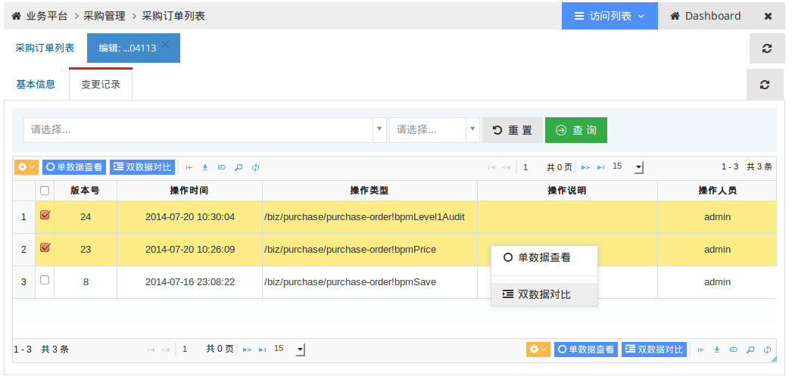
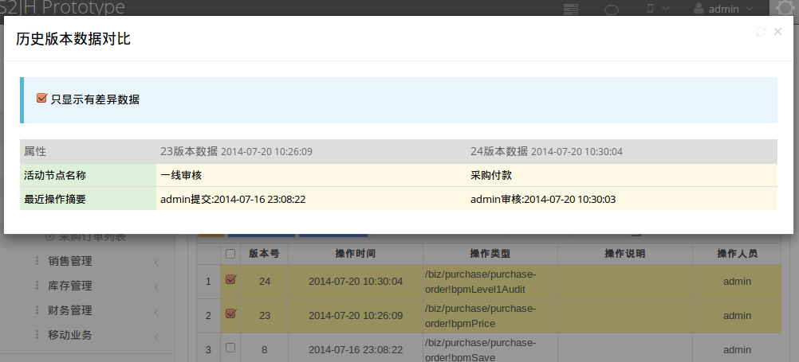
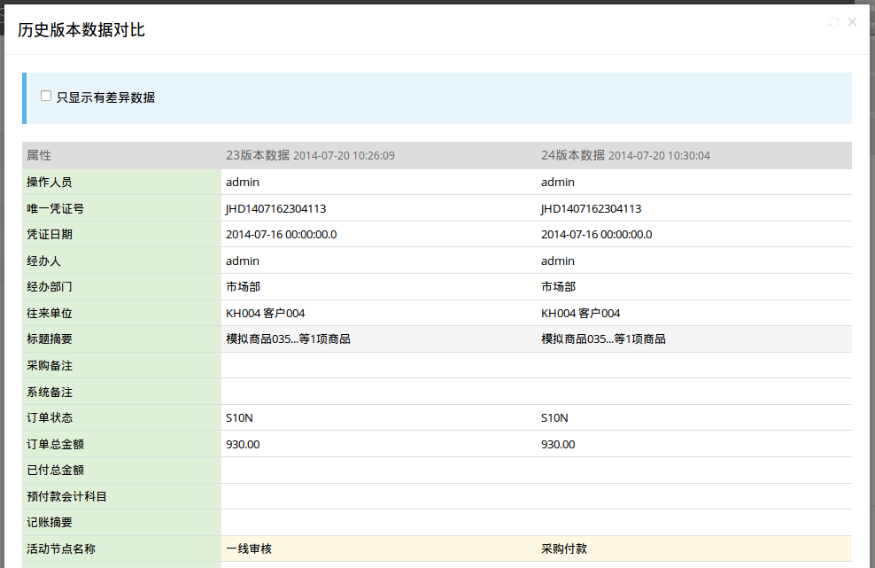

## 概要说明

借助Hibernate Envers组件，实现对数据变更进行自动的审计记录，并增强扩展设计实现通用的历史版本数据列表和对比查看UI功能。

基本原理：就是为每个Audited的对象数据表创建一个对应_AUD结尾的审计数据存储表，然后借助Hibernate Listener机制把对数据的增删改操作涉及的快照数据记录搬迁到_AUD审计数据表。
因此审计数据表根据业务操作的频率可能增长会很快，可以考虑一些分库分区等优化措施来减少对业务数据存取效率的影响，启用此功能之前建议仔细阅读官方文档说明及考虑一定的调优措施。
[Hibernate Envers](http://docs.jboss.org/hibernate/orm/4.1/devguide/en-US/html/ch15.html)

## 框架扩展

一般来说，Hibernate Envers记录的这些审计数据，主要用在以外丢失数据找回、审查数据合法性、辅助问题分析等用途，一般直接数据库SQL查询分析即可。

考虑到使用的便捷性，开发框架扩展提供了一个通用的UI功能，展示数据变更记录列表和不同版本对比查看视图。
框架提供的是一个通用的实现，因此可能存在一些不合理的地方，如对比视图可能会把一些用户不应该看到的、不应该显示的数据都呈现，因此在实际业务是否提供此UI视图可酌情考虑，或参考通用实现的基础上进行定制化处理。

* 版本列表视图：

* 版本对比视图：

### 关于列表界面“操作类型”，“原状态”，“新状态”，“操作说明”几个属性的处理

上述截图由于数据操作逻辑很简单，就是简单的修改，因此这几个属性都为空。实际审计的业务操作一般上述几个属性的处理，以某某审批操作为例：

**操作类型**： 用于标识业务操作动作，如“提交”审批，“审核”提交等操作，一般对应于Web Controller层面某个方法的的调用；

**原状态，新状态**： 一般业务操作都涉及到数据对象的状态变更，如“提交”操作涉及从“草稿”迁移到“待审”状态，“审核”操作涉及到从“待审”迁移到“审核通过”或“审核未过”状态变化等；

**操作说明**： 用于补充记录操作的原因、过程、结果等说明，如审核不过的原因等；